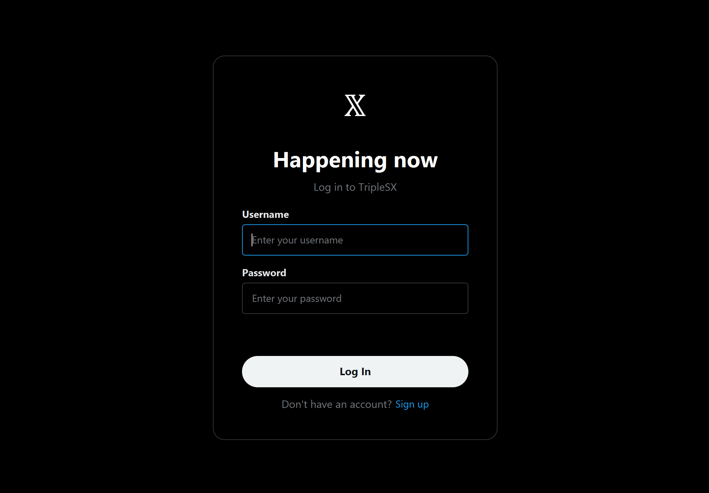
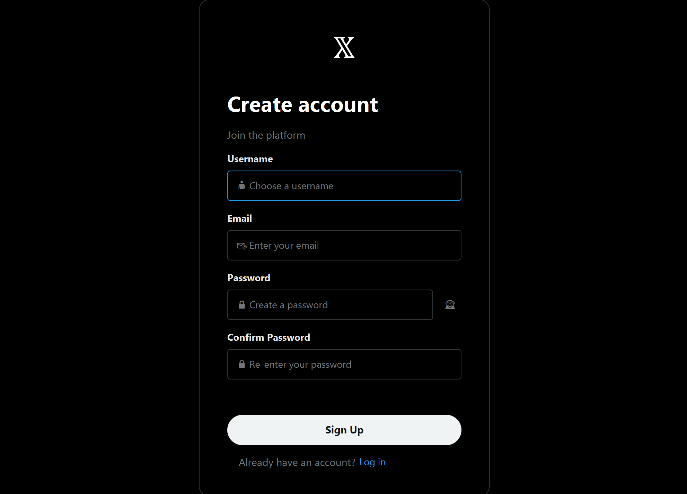
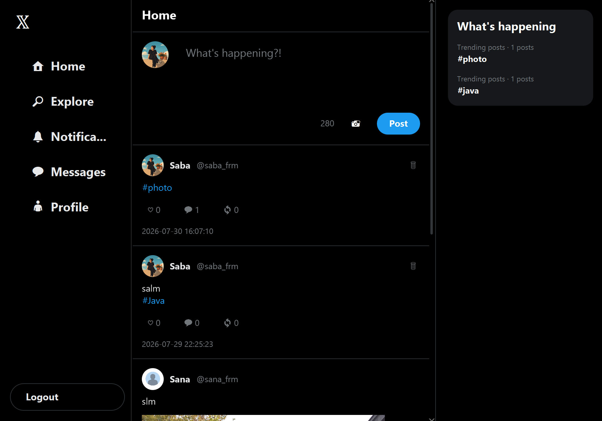
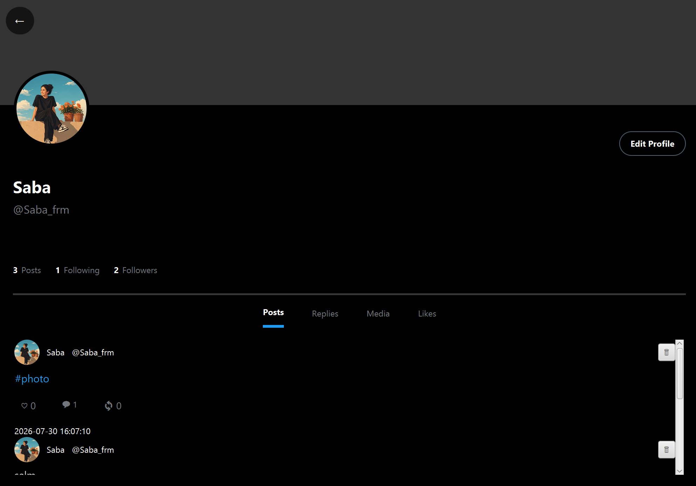
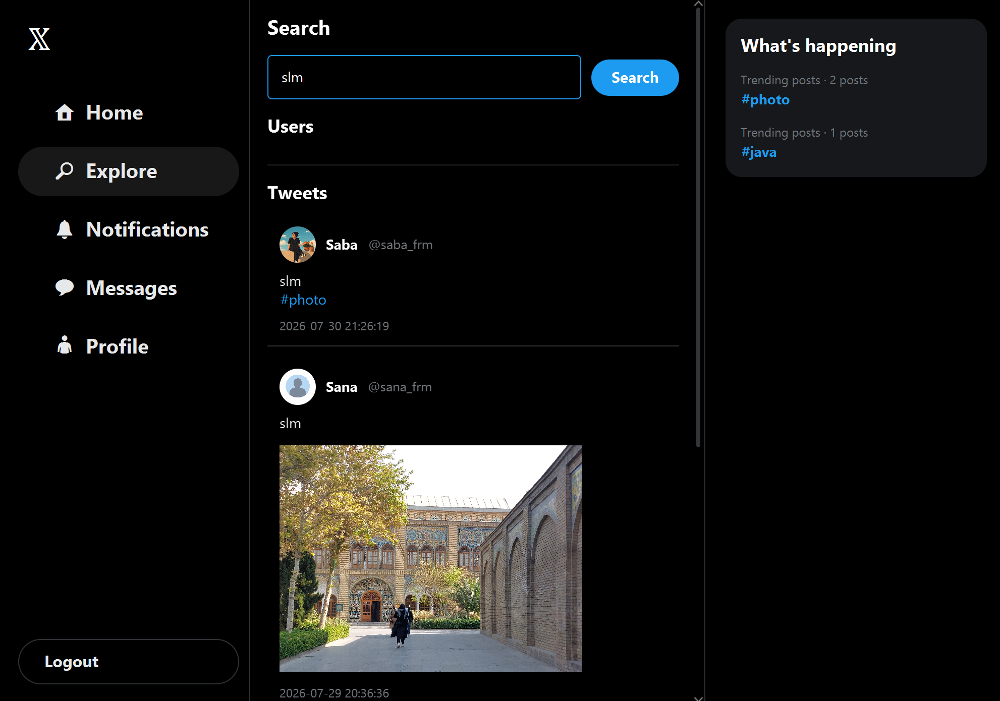
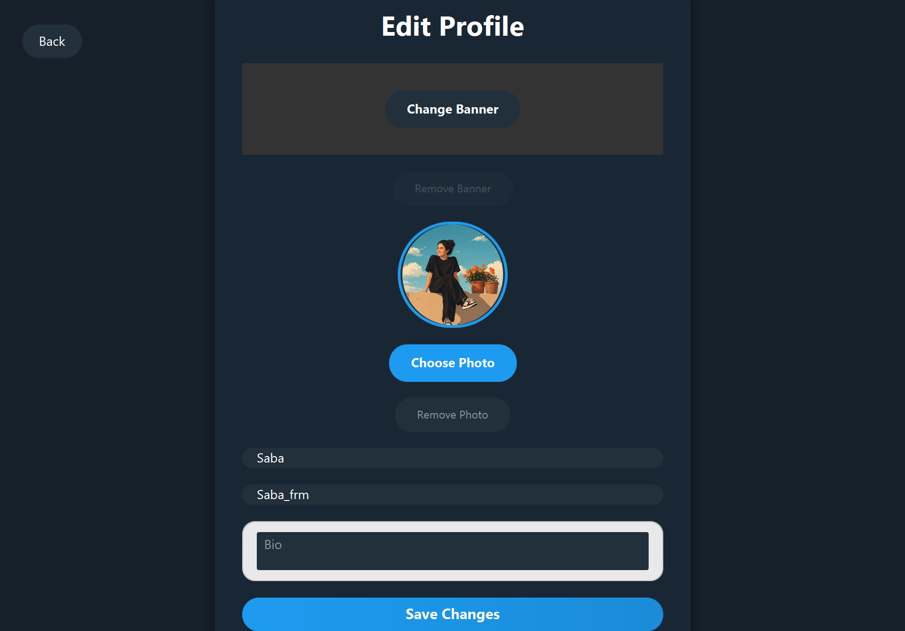
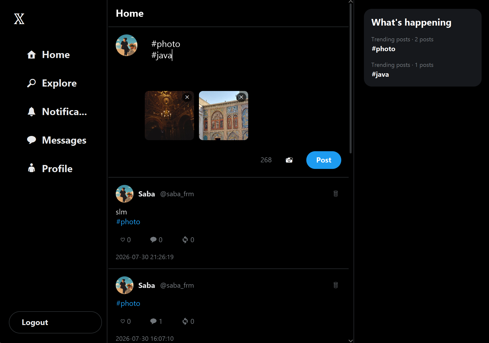

# 𝕏 TripleSX
- ## Advanced Social Media Platform

[](https://www.oracle.com/java/)
[](https://openjfx.io/)
[](https://www.postgresql.org/)
[](https://maven.apache.org/)
[]()

---

## 📋 Table of Contents
- [🌟 Project Overview](#-project-overview)
- [✨ Key Features](#-key-features)
- [🏗️ System Architecture](#-system-architecture)
- [🛠️ Technology Stack](#-technology-stack)
- [📂 Project Structure](#-project-structure)
- [🚀 Setup & Installation](#-setup--installation)
- [📖 Usage Guide](#-usage-guide)
- [💻 Code Examples](#-code-examples)
- [📊 Database Design](#-database-design)
- [📝 Changelog](#-changelog)
- [👥 Contributors](#-contributors)

---

## 🌟 Project Overview
TripleSX aims to replicate the dynamic ecosystem of a modern social network. The platform enables users to share media-rich content, interact through a complex social graph, and receive updates in real-time. The core focus was to handle concurrency on the server side and provide a seamless, responsive UI on the client side.

---

## 📸 Visual Demo & Screenshots
*Here is a preview of the TripleSX interface in action:*

| **Login Screen** | **Registration** |
|:---:|:---:|
|  |  |
| *Secure entry with jBCrypt hashing* | *New user onboarding* |

| **Home Feed (Real-time)** | **User Profile** |
|:---:|:---:|
|  |  |
| *Dynamic timeline with push notifications* | *Stats, posts, and media display* |

| **Search & Explore** | **Edit Profile** |
|:---:|:---:|
|  |  |
| *Global search for users and hashtags* | *Customizing avatars and banners* |

| **Media Upload & Preview** |
|:---:|
|  |
| *Preview and manage attachments before posting* |

---

## ✨ Key Features

### 🔐 User Management & Security
- **Secure Authentication:** Registration and Login system powered by **jBCrypt** for secure password hashing.
- **Enhanced Profiles:** Fully customizable user profiles with support for:
    - Display Names & Unique Usernames.
    - Personal Bios.
    - Custom Avatars and Profile Banner images.
- **Social Graph:** Dynamic "Follow/Unfollow" system with real-time updated follower/following counts.

### 🐦 Tweet Ecosystem
- **Rich Media Support:** Post tweets with long-form text and **multiple image attachments**.
- **Real-time Home Feed:** A personalized timeline delivering new tweets from followed users instantly via **Push Notifications** (using a dedicated background listener thread).
- **Advanced Interactions:**
    - **Likes & Unlikes:** Express appreciation for content.
    - **Threaded Replies:** Engage in conversations with structured reply chains.
    - **Retweets:** Amplify posts by sharing them with your own followers.
- **Content Management:** Users can delete their tweets/retweets with a native-style UI confirmation modal.

### 🔍 Explore & Hashtags
- **Automated Hashtag Detection:** Intelligent parsing of `#hashtags` within the tweet text.
- **Interactive Search:** Clickable hashtags and a global search system to find users, specific tweet content, or trending tags.
- **Trending Panel:** Stay updated with the most talked-about topics on the platform.

### 🎨 Premium UI/UX
- **X-Inspired Dark Mode:** A modern, sleek dark interface built for comfort and aesthetics.
- **Responsive Layout:** Optimized for various window sizes using JavaFX HBox/VBox scaling.
- **Interactive Components:** Custom CSS styling for hover effects, smooth transitions, and rounded media previews.

---

## 🏗️ System Architecture
The application is built on a **Decoupled Client-Server Model**:

### **Server-Side**
- **Concurrency:** Uses `ServerSocket` and a `CachedThreadPool` to manage multiple simultaneous client connections.
- **Request Processing:** A centralized `RequestProcessor` handles custom JSON-based protocols for all actions.
- **Real-time Engine:** The `ConnectionManager` tracks active `Socket` sessions to "push" content (like new tweets or deletions) to online users instantly.
- **Persistence:** High-performance data handling using **PostgreSQL** and **JDBC** with optimized indexing.

### **Client-Side**
- **MVC Pattern:** Strict adherence to Model-View-Controller for clean code separation.
- **Networking:** A singleton `NetworkManager` handles the persistent TCP connection and asynchronous request/response queuing.
- **Background Listening:** A dedicated `ListenerThread` constantly monitors the socket for server-initiated broadcasts to update the UI without manual refreshing.

---

## 🛠️ Technology Stack
- **Language:** Java 21 (LTS)
- **GUI Framework:** JavaFX 21 + FXML + CSS
- **Database:** PostgreSQL 18.4
- **Communication:** TCP Sockets / JSON Protocol
- **Dependencies:**
    - `org.json` (Data Serialization)
    - `jBCrypt` (Security)
    - `PostgreSQL JDBC Driver`
- **Build Tool:** Maven

---

## 📂 Project Structure
```bash
TripleSX/
├── client/                 # Client-side application
│   ├── src/main/java/      # JavaFX Controllers & Network Logic
│   └── src/main/resources/ # FXML layouts, CSS styles, and Icons
├── server/                 # Server-side application
│   └── src/main/java/      # ClientHandlers, RequestProcessor, and JDBC
├── database/               # SQL scripts
│   └── schema.sql          # Full DDL for PostgreSQL tables
└── pom.xml                 # Project dependencies and Build config
```
---
## 🚀 Setup & Installation
### 1. Prerequisites
- JDK 21 or higher.
- PostgreSQL server.
- Maven build tool.
### 2. Database Setup
- Create a database in PostgreSQL (e.g., postgres).
- Run the SQL script found in database/schema.sql to generate tables.
- Update the database credentials in server/src/main/java/server/DatabaseManager.java:
```bash
private static final String PASSWORD = "your_secure_password";
```
### 3. Running the Application
- Start the Server: Run MainServer.java. It will start listening on port 5000.
- Start the Client: Run Launcher.java. You can open multiple instances to test real-time features.
---
## 📖 Usage Guide
- 1.**Authentication:** Start by creating an account in the "Sign Up" screen.
- 2.**Posting:** Use the text area in the Home feed to write a post. Click the 📸 icon to attach images.
- 3.**Interacting:** Click on any tweet to view its details, including likes and the reply tree.
- 4.**Profile:** Navigate to your profile via the sidebar to update your Bio, Avatar, or Banner.
- 5.**Explore:** Use the search bar to find users by handle or search for specific hashtags like `#TripleSX`.
---
## 💻 Code Examples
#### JSON Protocol Example (Like a Tweet)
```bash
{
"action": "like_tweet",
"username": "saba_frm",
"tweet_id": 142,
"requestId": "550e8400-e29b-41d4-a716-446655440000"
}
```
#### Client-Side Real-time Listener (Snippet)

```bash
// Inside NetworkManager.java
if (message.has("type")) {
    String type = message.optString("type", "");
    if ("NEW_TWEET".equals(type)) {
        Platform.runLater(() -> {
            HomeController.getInstance().addTweetToFeed(message, true);
        });
    }
}
```

---
## 📊 Database Design
- The relational schema ensures data integrity and fast retrieval:
    - `users` : Core account data and file paths for media.
    - `tweets`: Handles original posts, replies (`parent_tweet_id`), and retweets (`is_retweet_of`).
    - `tweet_media`: Allows a one-to-many relationship for images per tweet.
    - `hashtags` & `tweet_hashtags`: Enables efficient searching and trend tracking.
    - `likes` & `follows`: Junction tables for many-to-many social interactions.
---
## 📝 Changelog

- **v1.0.0 (Final Release)** 
  - Real-time tweet delivery via TCP socket broadcast listener.
  - Multi-image attachments with preview modals.
  - Automatic `#hashtag` detection, global search, and trending topics.
  - X-inspired Dark Theme with responsive JavaFX styling.

- **v0.3.0 (Social Graph & Interactions)** 
  - Follow/Unfollow system with live follower/following counts.
  - Likes, retweets, and structured threaded reply chains.
  - Personalized timeline algorithm for followed accounts.

- **v0.2.0 (Tweets & Core Feed)** 
  - Text tweet publishing, deletion, and timestamp tracking.
  - Chronological home timeline and user profile post history.

- **v0.1.0 (Architecture & Authentication)** 
  - Multithreaded socket server (`CachedThreadPool`) & custom JSON protocol.
  - PostgreSQL database schema with JDBC persistence.
  - User registration, login, and secure password hashing with `jBCrypt`.
---
## 👥 Contributors
- Saba Faramarzi (https://github.com/sabafaramarzi1385)
    - Email: saba.faramarzi.1385@gmail.com
- Saeed Jamali (https://github.com/sj9981)
    - sj9981@hotmail.com
- Shayan Edalatjoo (https://github.com/Shedalatjoo)
    - ShayanEdalatjoo007@gmail.com
---
## 📞 Contact & Support
- #### Developed for the Advanced Programming Course - Summer 2026
- ##### Instructor: Dr. Saeed Reza Kheradpisheh
- ##### University: Shahid Beheshti University (SBU)